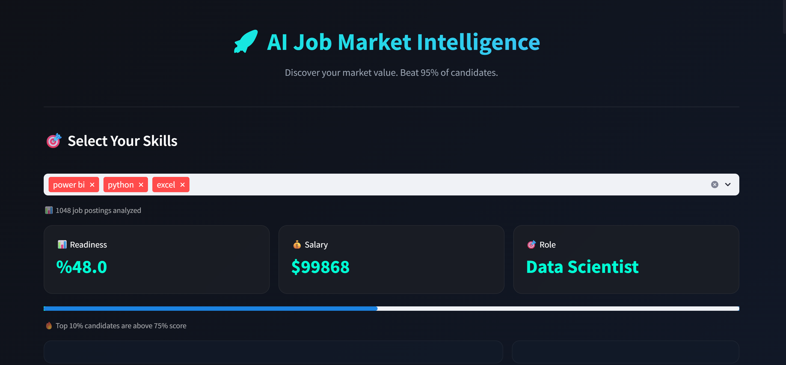
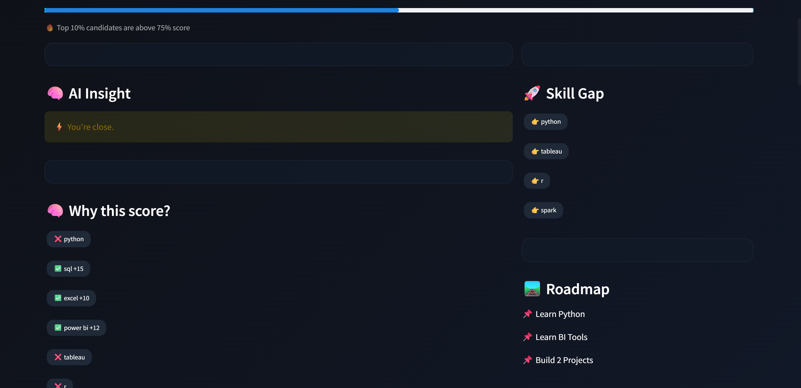
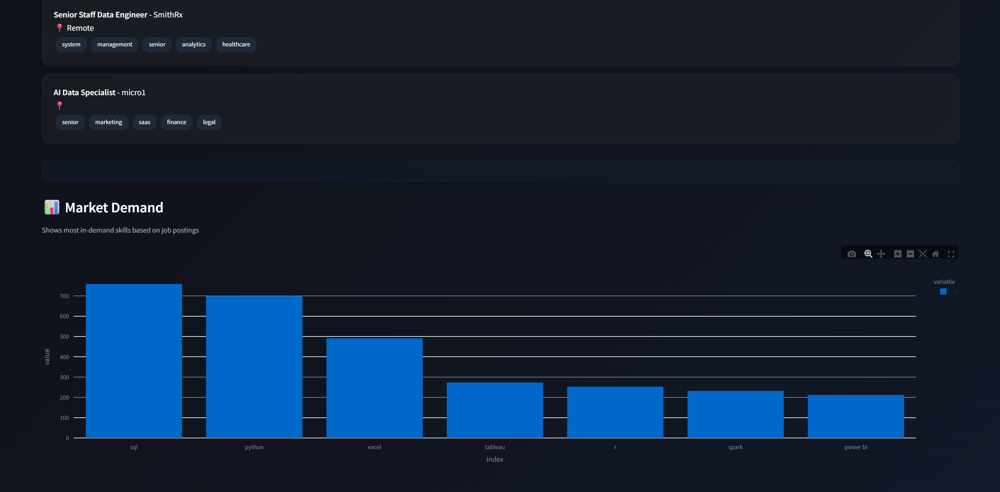

# 🚀 AI Job Market Intelligence

## 📸 Demo

---

## 💡 Key Insight

👉 SQL + BI + Python combination is more valuable than Python alone.

---

## 🧠 About

A data-driven platform that analyzes real job postings to help users understand their position in the job market.

---

## 🔥 Features

* 📊 Skill-based job readiness score
* 💰 Salary insights from real data
* 🎯 Personalized job matching
* 🌍 Live job market integration
* 📈 Market demand visualization

---

## 🧠 Problem

Many candidates don’t know:

* which skills are actually in demand
* how they compare to the market

This project solves that using real job data.

---

## ⚙️ Tech Stack

* Python (Pandas, Regex)
* Streamlit
* Plotly
* REST API

---

## 📊 Data

* 1000+ job postings analyzed
* Real salary dataset

---

## 🚀 Run Locally

pip install -r requirements.txt
streamlit run app.py

---

## 👩‍💻 Author

Ceren Aydın
